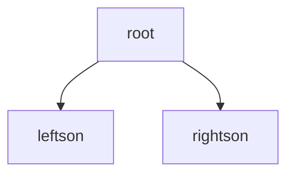

# Algorithm lecture given by Xiangyang Li

## Data:2020-10-20

## Topic:Data structure

Hash: convient for insert and delete

h(x<sub>i</sub>)=i collision:list $\Theta$(n) muliple hash table to avoid confict

Bloom filter:set and given a x,judge whether x in the set. Use hash Algorithm and allocate space to store the flag of the hash result(0 have 1 not)

## BinarySearch Tree



root>leftson leftson is a BinarySearch Tree

root<rightson rightson is a BinarySearch Tree

```C
typedef struct binarysearchtree{
    binarysearchtree * left,right;
    element value;
}binarysearchtree;
```

Inorder Traversal->O(n)计数法

```C
if x!=NULL {
    Inorder(x.left);
    print(x.value);
    Inorder(x.right);
}
```

Find the smallest(h is the height of the Tree)

Best condition h=$\Theta$($log_2(n)$)

Worst condition h=O(n)

$log_2(n)$<=h<=n Target:balance the binary tree