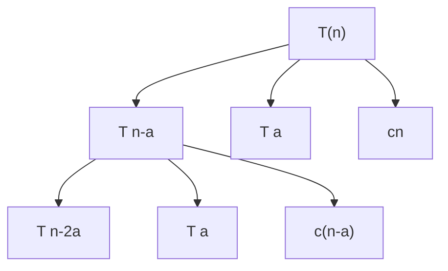

# 算法导论Hw1

## 作者：PB18030980 高海涵

### question 1：

（1）

```C
int find(array a[],int n,element v){
    for i in range(1,n){
        if(a[i]==v)
            return i;
    }
    return NIL;
}
```

(2) 循环前后的永真式，当i循环到j时，要么在a[j]中找到v，要么a[1]-a[j]中不含v（*）

j=1 根据a[1]==v判断数组中第一个元素是不是和v相匹配

假设j=k时，满足永真式，当j=k+1时

说明a[k]!=v,根据假设，a[1],a[2]....a[k-1]均不等于v

所以得到推论，a[1],a[2]....a[k]中均不含v

归纳结果：扩展数组成员，在数组末端增加一个元素，变成长度为n+1的数组

如果j=n+1，则得出结论，数组前n个元素没有v这个元素

反正，如果a[n]==v,则返回n，找到对应元素，而且可以确定前n-1个元素中没有对应的元素

### question 2:

a wrong f(n)=$1 \div n$

b right max(f(n),g(n))<f(n)+g(n)<2*max(f(n),g(n))

c $\Theta$(f(n))满足：$c_2$f(n)<$\Theta$(f(n))<$c_1$f(n)

O(f(n))满足：O(f(n))<=cf(n)

f(n)+O(f(n))>f(n)

f(n)+O(f(n))<=f(n)+c(f(n))=(c+1)f(n)

$c_1$=1,$c_2$=c+1

d wrong f(n)=g(n)=n

### question 3:

Stirling's approximation n!=$\Theta$($\sqrt(2*n*\Pi)$*$(n\div e)^n$)

lg(n!)=lg($\sqrt(2*n*\Pi)$)+nlg(n)-nlg(e)

所以lg(n!)=$\Theta$(nlg(n))

$\lim\limits_{n\rightarrow\infty}$n!$\div$$n^n$=$\lim\limits_{n\rightarrow\infty}$($\sqrt(n)$$\div$$e^n$)=0 n!=o($/n^n$)

$\lim\limits_{n\rightarrow\infty}$n!$\div$$2^n$>$\lim\limits_{n\rightarrow\infty}$$(n\div 2e)^n$=$\infty$ n!=$\omega$($2^n$)

### question 4:

T(n)=O(lg(n)) T(n/2)=O(lg(n/2))=O(lg(n)-1)

T(n/2)+1=O(lg(n)-1)+O(1)=O(lg(n))=T(n)

### question 5:




​	只画出递归树的两层结构，可以看出，时间复杂度的递归式为

$$T=c(n+n-a+n-2a+......+0)+T(a)*n\div a=n^2 \div 2a+T(a)*n \div a$$

$$T=\Theta(n^2) $$

## question 6:

(a) b=4 a=2 $log_24=1\div 2$

case 3: $\sqrt(n)$=$\Theta$($n^{0.5}\times(lgn)^k$) k=0 $T(n)=\Theta(\sqrt(n)\times lgn)$

(b) $$ f(n)=n^2=\Omega(n^{1/2-\epsilon}) T(n)=\Theta(n^{1/2})$$ 

## question 7:

$$a=4,b=2,log_ba=2,n^2,n^2<n^2\times lgn$$

$$但是不存在\epsilon,使得n^2lgn=\Omega(n^{2+\epsilon})$$

不能使用主方法

对于此问题，采用递推式展开计算

assume   $$n=2^k$$

$$T(n)=T(2^k)=4\times T(2^{k-1})+4^k\times k$$

$$T(2^{k-1})=4\times T(2^{k-2})+4^{k-1}\times (k-1)$$

代入得$$T(2^k)=16\times T(2^{k-2})+4^k(k+(k-1))$$

迭代至T(1) $$T(2^k)=4^k\times T(1)+4^k\displaystyle \sum^{i=0 \to k}{i}$$

利用求和公式，得到最终结果 $$T(2^k)=4^k\times T(1)+4^k\times(k+1)\times k\div2$$

在k->$\infty$ 得到

$$T(2^k)=\Theta(T(1)\times 4^k+4^k\times k^2)$$

最终结果是

$$ T(n)=\Theta(({n})^2\times log_2(n)) $$


