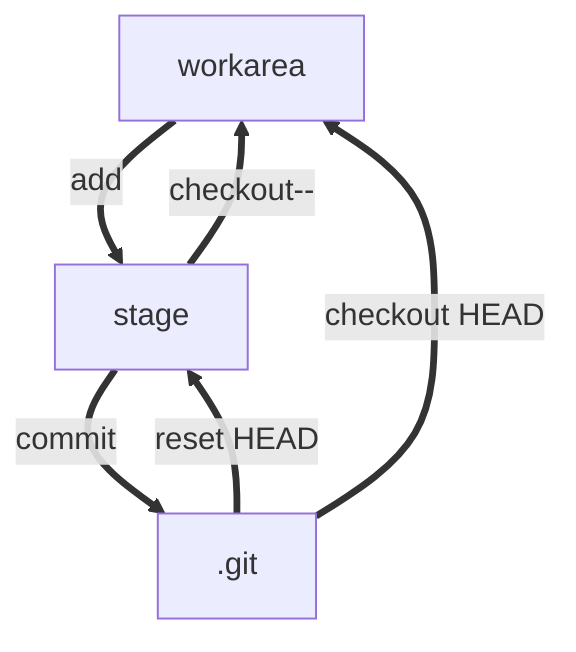

# Git使用指南

## 工作区、暂存库和版本库

### 概念

* 工作区：电脑中能看到的目录
* 暂存区：.git目录下的index文件，称为索引
* 版本库：工作区隐藏目录.git

### 关系

* master:master分支所代表的目录树
* HEAD指向master分支的一个游标
* object为Git的对象库，包含了创建的各种对象和内容
* 对工作区的修改、新增的文件执行git add，暂存区的目录树被更新，工作区修改、新增的文件内容写入对象库的新的对象中，该对象的ID被记录在暂存区的文件索引中
* git commit暂存区的目录树写到版本库中，master分支作相应的更新
* git reset HEAD暂存区的目录树被重写，被master分支指向的目录树所替换，但是工作区不受影响
* git rm --cached <file> 直接从暂存区删除文件，工作区不做出改变

## git 创建仓库

### git init

### git clone

git clone <repo> <directory>

<repo> is the remote repo <directory> local folder

git clone could take several protocol, such as ssh,git and http,we usually take the ssh protocol

git blame <file>列表形式查看制定文件的历史修改记录

## Git常见操作

### git diff：比较两个文件的不同

## 分支管理

