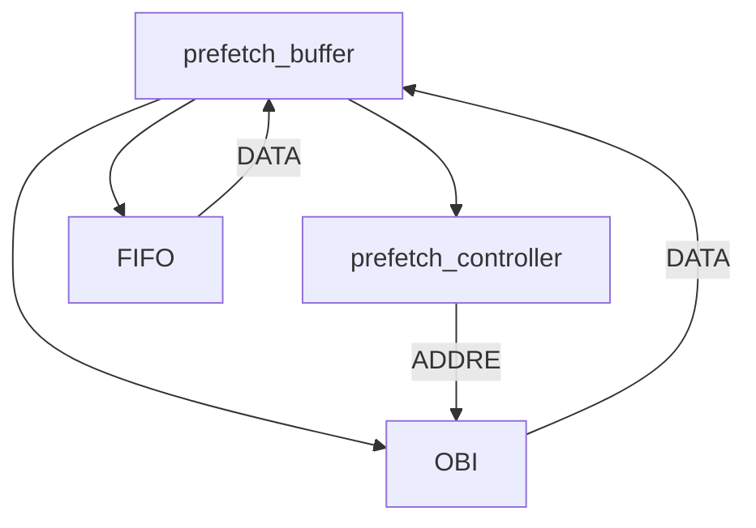

# RISC-V源码阅读报告

## 顶层模块core

### parameter

| 参数名           | 调用参数的模块                     | function |
| ---------------- | ---------------------------------- | -------- |
| PULP_XPULP       | IF，ID，cs_registers，generate     |          |
| PULP_CLUSTER     | sleep_unit,id,cs_register,generate |          |
| FPU              | IF,ID,EX,cs_register               |          |
| PULP_ZFINX       | ID                                 |          |
| NUM_MHPMCOUNTERS | cs_register                        |          |

### input signal

| signal name         | width | function                        | from            |
| ------------------- | ----- | ------------------------------- | --------------- |
| clk_i               | 1     | clock signal                    | external        |
| rst_ni              | 1     | reset                           | external        |
| pulp_clock_en_i     | 1     | pulp_clock                      | sleep_unit      |
| scan_cg_en_i        | 1     |                                 | sleep_unit ID   |
| boot_addr_i         | 32    | boot_address                    | IF              |
| mtvec_addr_i        | 32    |                                 | cs_register     |
| dm_halt_addr_i      | 32    |                                 | IF              |
| hart_id_i           | 32    |                                 | cs_register     |
| dm_exception_addr_i | 32    | ddbug module halt address       | IF              |
| instr_gnt_i         | 1     |                                 | pmp             |
| instr_rvalid_i      | 1     | instruction_cache interface     | IF              |
| instr_rdata_i       | 32    | read the instruction from cache |                 |
| data_gnt_i          | 1     |                                 | cs_register,PMP |
| data_rvalid_i       | 1     | output to data memory           | load_store_unit |
| data_rdata          | 32    | output to data memory           | load store unit |

### output signal

| signal name  | width | function                                | toward       |
| ------------ | ----- | --------------------------------------- | ------------ |
| instr_req_o  | 1     | get shake hand signal from instr_memory | PMP          |
| instr_addr_o | 32    | address of the instruction Memory       |              |
| data_req_o   | 1     | shake hang signal towards the bus       |              |
| data_we_o    | 1     | write enable to instruction             | Data Mermory |
| data_be_o    | 4     | byte enable of the word                 | Data Memory  |
| data_addr_o  | 32    | address to the Memory                   | Data Memory  |
| data_wdata_o | 32    | write data to the Memory                | Data Memory  |

### 次级模块

| 模块名          | 模块功能             | 与顶层模块交互接口                                           |
| --------------- | -------------------- | ------------------------------------------------------------ |
| sleep_unit      | 进入睡眠模式         | clk                                                          |
| IF              | 取指令               | 顶层模块提供地址输入，取指模块返回指令和相关握手信号，返回是否取值成功给下一级模块ID |
| ID              | 译码                 | 取上一级模块生成的指令译码生成控制信号                       |
| EX              | 执行                 | 乘除法和ALU分离                                              |
| load_store_unit | 访问数据存储器的接口 | 提供信号、写入数据和地址，返回数据存储器的读出数据           |
| APU,FPU         | 扩展功能             |                                                              |

## 取值模块IF

### 宏定义

| 宏名        | 功能 | 调用模块                 |
| ----------- | ---- | ------------------------ |
| PULP_XPULP  |      | prefetch_buffer generate |
| PULP_OBI    |      | prefetch_buffer          |
| PULP_SECURE |      | generate                 |
| FPU         |      | compressed_decoder       |

### 输入信号

| 信号名              | 位宽 | 功能                                                         | 来自                                                         |
| ------------------- | ---- | ------------------------------------------------------------ | ------------------------------------------------------------ |
| clk                 |      |                                                              |                                                              |
| rst_n               |      |                                                              |                                                              |
| m_trap_base_addr_i  | 24   | 赋值给trap_base_addr                                         | cs_register                                                  |
| u_trap_base_addr_i  | 24   | 赋值给tarp_base_addr                                         | cs_register                                                  |
| trap_addr_mux_i     | 2    | 选择信号，选择m_trap_base_addr_i或是u_trap_base_addr_i       | ID_stage                                                     |
| boot_addr_i         | 32   | 启动地址                                                     | top module external input                                    |
| dm_exception_addr_i | 32   |                                                              | top module external input                                    |
| dm_halt_addr_i      | 32   | 调试模式，停止地址                                           | top module external input                                    |
| req_i               | 1    | instruction request control                                  | ID_stage                                                     |
| instr_gnt_i         | 1    | instr_gnt_pmp=(PMP is valid)?output of PMP:input signal from top module instr_gnt_i |                                                              |
| instr_rvalid_i      | 1    |                                                              | top module external input                                    |
| instr_rdata_i       | 32   |                                                              | top module external input                                    |
| instr_err_i         | 1    | bus error                                                    | 1'b0 constant                                                |
| instr_err_pmp_i     | 1    | PMP_error                                                    | instr_err_pmp comes from PMP module when the PMP is valid and is constant 1'b0 when invalid |
| clear_instr_valid_i | 1    | clear instruction valid bit                                  | ID_stage                                                     |
| pc_set_i            | 1    | set the program counter to a new value                       | ID_stage                                                     |
| mepc_i              | 32   | 中断异常发生时重新存储PC的地址                               | csr                                                          |
| uepc                | 32   | 中断异常发生时重新存储PC的地址                               | csr                                                          |
| depc_i              | 32   | 进入debug模式，存储PC                                        | csr                                                          |
| pc_mux_i            | 4    | PC multiplexer choose signal                                 | ID_stage                                                     |
| exc_pc_mux_i        | 3    | ISR address multiplexer choose signal                        | ID_stage                                                     |
| jump_target_id_i    | 32   | jump target address(jump is implemented in the ID stage)     | ID_stage                                                     |
| jump_target_ex_i    | 32   | branch target address(branch is implemented in the EX stage) | EX_stage                                                     |
| hwlp_jump_i         | 1    | from Hwloop controller                                       | ID_stage                                                     |
| hwlp_target_i       | 32   | branch                                                       | ID_stage                                                     |
| halt_if_i           | 1    | generate the signal if_valid=(~halt_if_i)&if_ready means the if_valid=1 only when halt_if_i=1 && if_ready=1 | ID_stage                                                     |
| id_ready_i          | 1    | generate the signal if_ready=fetch_valid & id_ready_i means the if_ready=1 only when fetch_valid=1 && id_ready_i=1 | ID_stage                                                     |

### 输出信号

| 信号名              | 位宽 | 功能                                                         | 流向                                                         | 生成自             |
| ------------------- | ---- | ------------------------------------------------------------ | ------------------------------------------------------------ | ------------------ |
| instr_req_o         | 1    | give the requirement to seek an instruction through the bus and the requirement is made | prefetch_buffer PMP                                          |                    |
| instr_addr_o        | 32   | instruction address                                          | prefetch_buffer                                              |                    |
| instr_valid_id_o    | 1    | give the next stage that the instruction is valid or not,the value is 1 when **if_valid** and **instr_valid** are both 1 |                                                              |                    |
| is_compressed_id_o  | 1    | is it a compressed instr,generate by the value **instr_compressed_int** when **if_valid** and **instr_valid** are both valid | the next stage                                               | compressed_decoder |
| illegal_c_insn_id_o | 1    | when compressed decoder thinks it is an invalid instruction  | next_stage                                                   | compressed_decoder |
| pc_if_o             | 32   |                                                              |                                                              | aligner            |
| pc_id_o             | 32   | pc_id_o=pc_if_o                                              |                                                              |                    |
| is_fetch_failed_o   | 1    | fetch_failed                                                 |                                                              |                    |
| csr_mtvec_init_o    | 1    | tell CS register file to init mtvec                          | the value is 1 whe n pc_mux_i==PC_BOOT and pc_set_i signal is 1 |                    |
| if_busy_o           | 1    | The IF stage busy fetching instructions                      |                                                              |                    |
| perf_imiss          | 1    | Instruction Fetch Miss                                       |                                                              |                    |

### 次级模块

| 模块名              | 功能 | 与上级模块接口 |
| ------------------- | ---- | -------------- |
| aligner_i           |      |                |
| compressed_decode_i |      |                |
| prefech_buffer      | 预取 |                |

### 接口说明

### input

| 信号名              | 信号来源 | 信号功能 |
| ------------------- | -------- | -------- |
| m_trap_base_addr_i  |          |          |
| boot_address        |          | 启动地址 |
| dm_exception_addr_i |          |          |
|                     |          |          |
| dm_halt_addr_i      |          |          |
| instr_gnt           |          |          |
| instr_err_i         |          |          |
| instr_rvalid        |          |          |
| instr_err_pmp_i     |          |          |
| instr_rdata_i       |          |          |

## 译码模块ID

### 次级模块

| 模块名        | 功能       | 与上级模块接口 |
| ------------- | ---------- | -------------- |
| register_file | 寄存器文件 |                |
| decoder       | 译码器     |                |
| controller    |            |                |
| int_control   | 中断控制   |                |

### 输入信号

| 信号名                 | 位宽 | 来自       | 功能 | 流向和功能                                           |
| ---------------------- | ---- | ---------- | ---- | ---------------------------------------------------- |
| clk                    | 1    | 顶层模块   |      | 时钟                                                 |
| clk_ungated_i          | 1    | 顶层模块   |      | 门控时钟                                             |
| rst_n                  | 1    | 顶层模块   |      | 复位信号                                             |
| scan_cg_en_i           | 1    | sleep_unit |      | register_file                                        |
| fetch_enable_i         | 1    | sleep_unit |      | controller                                           |
| instr_valid_i          | 1    | IF         |      | controller\|generate the hwlp_valid                  |
| instr_rdata_i          | 32   | IF         |      | decoder\|**instr=instr_rdata_i**                     |
| is_compressed_i        | 1    | IF         |      | controller                                           |
| illegal_c_incs_i       | 1    | IF         |      | decoder                                              |
| branch_decision_i      | 1    | EX         |      | **brnacj_taken_ex=branch_in_ex_o&branch_decosion_i** |
| is_fetch_failed_i      | 1    | IF         |      | controller                                           |
| pc_id_i                | 32   |            |      | controller                                           |
| ex/wb_ready_i          | 1    | EX/WB      |      | EX/WB is ready for the next instruction              |
| current_priv_lvl_i     |      |            |      |                                                      |
| csr_hwlp_regid_i       |      |            |      |                                                      |
| csr_hwlp_we_i          |      |            |      |                                                      |
| csr_hwlp_data_i        |      |            |      |                                                      |
| data_misaligned_i      |      |            |      |                                                      |
| data_err_i             |      |            |      |                                                      |
| irq_i                  |      |            |      |                                                      |
| irq_sec_i              |      |            |      |                                                      |
| mie_bypass_i           |      |            |      |                                                      |
| m_irq_enable_i         |      |            |      |                                                      |
| u_irq_enable_i         |      |            |      |                                                      |
| debug_req_i            |      |            |      |                                                      |
| debug_single_step_i    |      |            |      |                                                      |
| debug_ebreakm_i        |      |            |      |                                                      |
| debug_ebreaku_i        |      |            |      |                                                      |
| trigger_match_i        |      |            |      |                                                      |
| regfile_waddr_wb_i     | 6    |            |      |                                                      |
| regfile_we_wb_i        |      |            |      |                                                      |
| regfile_wdata_wb_i     | 32   |            |      |                                                      |
| regfile_alu_we_fw_i    |      |            |      |                                                      |
| regfile_alu_wdata_fw_i |      |            |      |                                                      |
| mult_multicycle_i      |      |            |      |                                                      |
| mcounteren_i           | 32   |            |      |                                                      |

## 执行模块EX

| 模块名 | 功能           | 与上级模块接口 |
| ------ | -------------- | -------------- |
| ALU    | 算数逻辑单元   |                |
| Mult   | 乘除法计算单元 |                |

## 访存接口load_store_unit

| 模块名 | 功能         | 与上级模块接口 |
| ------ | ------------ | -------------- |
| obi    | 算数逻辑单元 |                |

