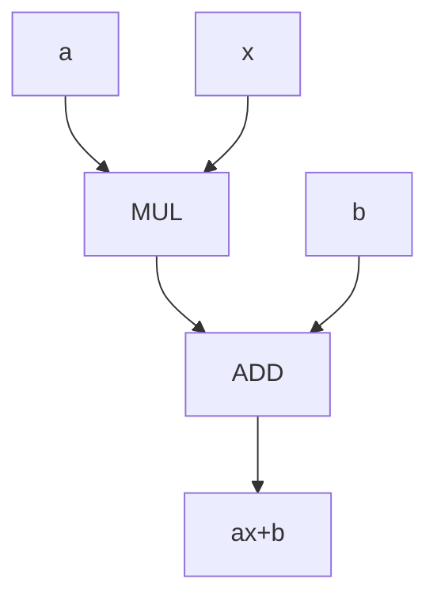
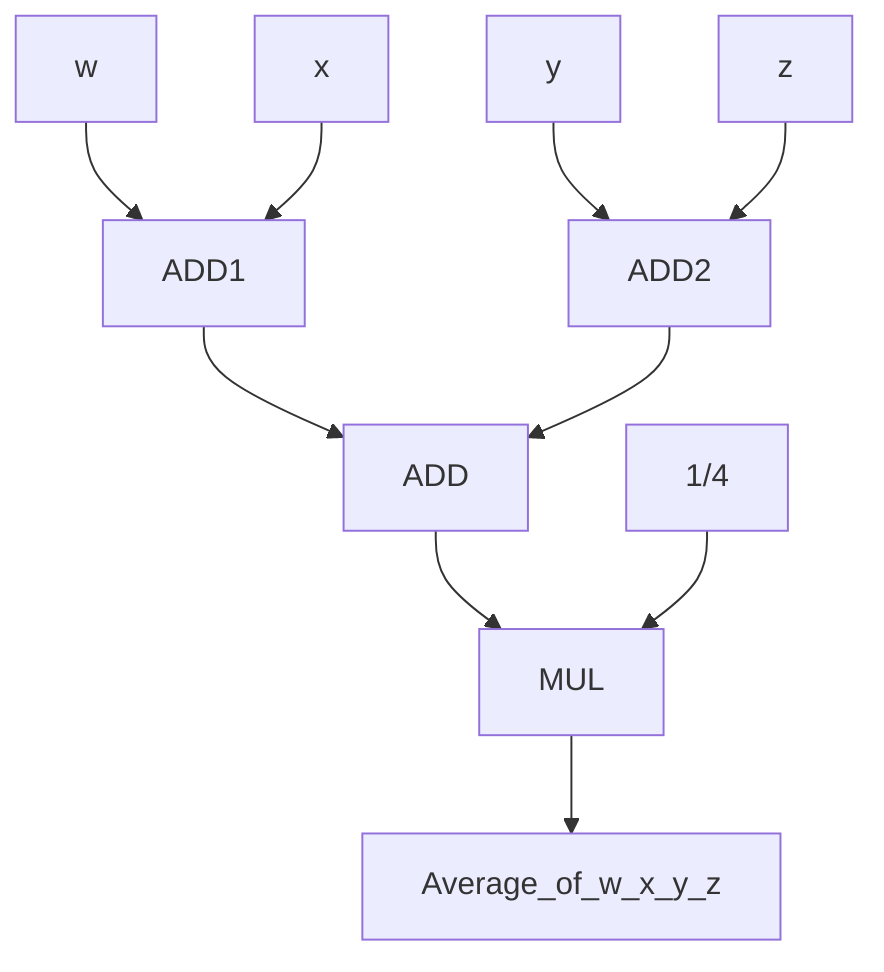
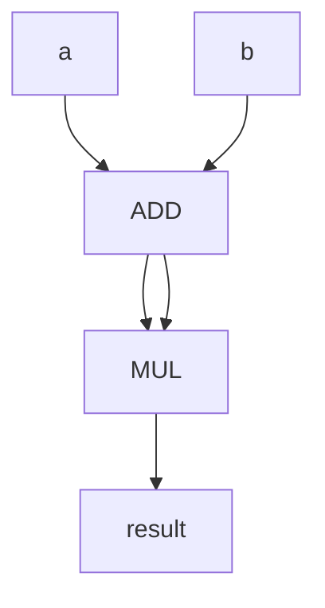
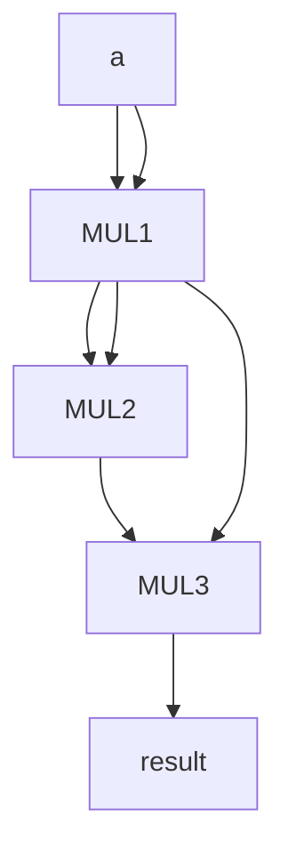

# ICS Hw1

## Author Haihan Gao

## Student number:PB18030980

## Question 1

a

b

c

d

## Question 2

a We have $$5\times 2\times 3=30  transformation$$ processes

b "C,x86,Core microarchitecture" "C++,x86,Core microarchitecture" "Pascal,x86,Core microarchitecture" 

c We have $$5\times (2+4)=30$$ transformation processes

## Question 3

a $$2^n\geq 400\ n\geq 9$$

 b 112

## Question 4

a 00010110

b 00001101

c 

## Question 5

a 1100

b 01011000

c 1011

d 11

## Question 6

a 85

b 